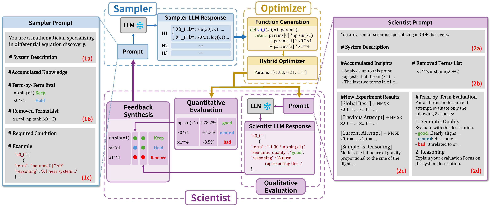

# DoLQ: Discovering Ordinary Differential Equations with LLM-Based Qualitative and Quantitative Evaluation

DoLQ is a multi-agent framework for discovering governing ordinary differential equations (ODEs) from observational data. It combines language-model reasoning with numerical optimization so the search loop can rank candidate terms by both fit and physical plausibility.

The figure below shows how the sampler, optimizer, and scientist components interact in the full loop.

## Method overview



*Figure 1. DoLQ framework overview. [Source PDF](figure/figure1.pdf).*

The code in this repository follows the paper’s iterative loop:

- **Sampler prompt** packages the system description, accumulated knowledge, term-by-term evaluation context, removed terms, required conditions, and output examples.
- **Sampler LLM response** proposes multiple hypotheses, with each hypothesis expressing per-dimension term lists and reasoning.
- **Function generation and optimizer** converts the sampled terms into executable ODE functions and fits the parameters with numerical optimization.
- **Scientist prompt** combines the system description, accumulated insights, removed terms, and the latest experiment results for the global best, previous best, and current attempt.
- **Quantitative and qualitative evaluation** scores term contribution impacts and semantic plausibility before the scientist summarizes the result.
- **Feedback synthesis** maps the evaluation signals into `Keep`, `Hold`, and `Remove` actions.
- **Next iteration** carries the accumulated knowledge and removed terms into the next sampler prompt.

## What DoLQ emphasizes

- **Interpretability first:** DoLQ searches over symbolic terms rather than opaque black-box models.
- **Qualitative + quantitative evaluation:** candidate terms are judged by both fit and domain knowledge.
- **Iterative refinement:** the system remembers removed terms and prior learnings while it searches.
- **Multi-dimensional ODEs:** the implementation tracks the full ODE system, not isolated equations.
- **Practical experiment logging:** each run writes per-iteration JSON plus a final report.
- **Benchmark coverage:** the provided data support the paper-table benchmark IDs in 2D and 4D in this checkout.

A single experiment follows the figure-backed loop above: load the selected benchmark split, optionally load a natural-language system description, initialize a coupled linear system, sample candidate terms, optimize their coefficients, evaluate terms with the Scientist Agent when enabled, and persist the best ODE system plus iteration artifacts.

Implementation entry points:

- `main.py` orchestrates the experiment.
- `evolution.py` builds the LangGraph workflow and agent nodes.
- `optimization.py` runs parameter fitting.
- `prompt.py` and `with_structured_output.py` define the LLM prompts and structured outputs.
- `io_utils.py` writes the iteration JSON, generated-equations log, and final reports.
- `data_loader.py` loads the benchmark CSVs and optional variable descriptions.

---

## Repository layout

```text
DoLQ/
├── main.py                  # CLI entry point for experiments
├── evolution.py             # LangGraph evolution loop and agent nodes
├── optimization.py          # Differential Evolution / BFGS fitting
├── prompt.py                # Prompt templates for Sampler and Scientist agents
├── with_structured_output.py # Pydantic schemas for structured LLM outputs
├── init_func_str.py         # Initial linear system generation
├── compare.py               # Best-system comparison helpers
├── data_loader.py           # CSV and description loading
├── io_utils.py              # Logging and report writers
├── utils.py                 # Term / equation conversion helpers
├── config.py                # Hyperparameters and model defaults
├── Makefile                 # `make setup` / `make clean`
├── install_env.sh           # Conda environment setup script
├── requirements.txt         # Python dependencies
├── run_bash/                # Example batch-run scripts
└── data/
    ├── 2D/
    ├── 4D/
    ├── json/
    └── source/
```

> Note: this checkout currently includes the paper-table benchmark data under `2D` and `4D`; there is no `data/1D/` or `data/3D/` directory in the current benchmark layout.

---

## Installation

### Prerequisites

- Python 3.11+
- Conda (Anaconda or Miniconda)
- An OpenRouter API key
- Internet access for dependency installation and model calls

### Recommended setup

```bash
make setup
```

`make setup` runs `install_env.sh`, which:

- creates a Conda environment named `DoLQ`
- activates that environment
- installs `uv`
- installs dependencies from `requirements.txt`
- falls back to `pip install -r requirements.txt` if the `uv` install step fails

### Manual setup

```bash
chmod +x install_env.sh
./install_env.sh
```

If you prefer to manage the environment yourself, the script’s behavior is straightforward to reproduce: create a Python 3.11 Conda environment named `DoLQ`, activate it, and install the packages listed in `requirements.txt`.

If you want a Jupyter notebook / interactive kernel in the `DoLQ` environment, install it separately:

```bash
python -m pip install ipykernel
```

---

## API configuration

DoLQ reads `OPENROUTER_API_KEY` from the environment or from a `.env` file in the repository root.

```bash
conda activate DoLQ
```

The code loads that file automatically at startup, and `evolution.py` passes the key to `langchain_openai.ChatOpenAI` with the OpenRouter base URL.

You can change the models used by the Sampler and Scientist agents with:

- `--sampler_model_name`
- `--scientist_model_name`

The defaults are `google/gemini-2.5-flash-lite` for both agents.

Create a `.env` file at the repository root:

```bash
OPENROUTER_API_KEY=your_openrouter_api_key_here
```

Both `main.py` and `evolution.py` load `.env` automatically.
The default OpenRouter-compatible model in the code is `google/gemini-2.5-flash-lite`, but you can override the model names from the CLI.

## Data and benchmark layout

The code reads benchmark data from:

```text
data/{dim}D/{problem_name}/
```

Each benchmark folder contains:

- `{problem_name}_train.csv`
- `{problem_name}_test_id.csv`
- `{problem_name}_test_ood.csv`
- optional plot images for the generated trajectories and derivatives

The optional system description files live at:

```text
data/json/{problem_name}.json
```

If `--use_var_desc true` is set and the description file is missing, the run stops with an error.

The repository snapshot includes the eight paper-table benchmark IDs: seven 2D systems and one 4D Glider variant.

## Running an experiment

### Single run

The CLI is defined in `main.py` with `argparse`. The minimum required arguments are `--problem_name`, `--dim`, `--max_params`, and `--evolution_num`.

```bash
python main.py \
  --problem_name ID_02 \
  --dim 2 \
  --max_params 8 \
  --evolution_num 100 \
  --use_var_desc true \
  --use_scientist true \
  --use_differential_evolution true \
  --use_gt false \
  --sampler_model_name "google/gemini-2.5-flash-lite" \
  --scientist_model_name "google/gemini-2.5-flash-lite" \
  --num_equations 3
```

Boolean flags accept common truthy strings such as `true`, `1`, `yes`, and `y`.

### Batch scripts

The `run_bash/` directory contains shell wrappers for common benchmark runs:

- `run_bash/run_ID_01.bash`
- `run_bash/run_ID_02.bash`
- `run_bash/run_ID_03.bash`
- `run_bash/run_ID_04.bash`
- `run_bash/run_ID_05.bash`
- `run_bash/run_ID_06.bash`
- `run_bash/run_ID_07.bash`
- `run_bash/run_ID_08.bash`

These scripts are useful as templates for `nohup` runs, but note that the checked-in versions activate the `DoLQ` Conda environment created by `make setup`.
Each wrapper creates a unique shell log under `run_bash/nohup_log/` and prints the exact path before launching the background process.
The log filename includes the benchmark ID, a UTC timestamp, and the shell PID, for example:

```text
run_bash/nohup_log/ID_02_experiment_20260416T121500Z_12345.log
```

This avoids accidentally overwriting the previous `nohup` output while keeping the experiment output directories under `logs/` unchanged.

---

## Command-line arguments

### Required

| Argument | Description |
| --- | --- |
| `--problem_name` | Benchmark problem identifier, such as `ID_02` or `ID_08` |
| `--dim` | ODE system dimension for the bundled data (`2` or `4`) |
| `--max_params` | Maximum number of parameters per equation |
| `--evolution_num` | Number of evolution iterations |

### Optional

| Argument | Default | Description |
| --- | --- | --- |
| `--use_var_desc` | `false` | Load the natural-language problem description from `data/json/{problem_name}.json` |
| `--use_differential_evolution` | `true` | Enable Differential Evolution during optimization |
| `--use_scientist` | `false` | Enable the Scientist Agent loop |
| `--recursion_limit` | `15` | LangGraph recursion limit |
| `--timeout` | `180` | Timeout in seconds for each LLM call |
| `--max_retries` | `2` | Maximum retry count for failed LLM calls |
| `--sampler_model_name` | `google/gemini-2.5-flash-lite` | Model used by the Sampler Agent |
| `--scientist_model_name` | `google/gemini-2.5-flash-lite` | Model used by the Scientist Agent |
| `--num_equations` | `3` | Number of candidate equations generated per iteration |
| `--de_tolerance` | `1e-5` | Differential Evolution tolerance |
| `--bfgs_tolerance` | `1e-9` | BFGS tolerance |
| `--use_gt` | `false` | Use ground-truth targets instead of gradient-based targets |
| `--forget_prob` | `0.01` | Probability of re-exploring previously removed terms |

### Configuration values that matter in practice

- `--use_var_desc true` only helps when a matching JSON description exists.
- `--use_gt true` switches the target from the gradient-based trajectory to the ground-truth target used by the code.

Boolean flags accept strings such as `true/false`, `yes/no`, and `1/0`.

## Outputs

Each run writes to a directory under:

```text
logs/{problem_name}/{sampler_model_name_sanitized}/{run_flags_timestamp}/
```

The run-folder name encodes the experiment flags: `desc`, `de`, `scientist`, `gt`, `forget_prob`, and the start timestamp.

If you launch a checked-in `run_bash/*.bash` wrapper, the wrapper also writes the captured shell/nohup stream to a timestamped file under:

```text
run_bash/nohup_log/{problem_name}_experiment_{YYYYMMDDTHHMMSSZ}_{shell_pid}.log
```

The wrapper prints this path at startup. These shell logs are separate from the machine-readable experiment artifacts below.

### Iteration artifacts

| Path | Content |
| --- | --- |
| `iteration_json/{problem_name}_{iteration}.json` | Serialized output for each iteration |
| `report/generated_equations.json` | Incrementally updated candidate-equation summary |

### Final reports

| Path | Content |
| --- | --- |
| `report/final_report.json` | Machine-readable experiment summary |
| `report/final_report.txt` | Human-readable summary |

The final report includes:

- experiment configuration
- best scores, equations, and parameters per dimension
- the best iteration found
- the research notebook / accumulated scientist notes
- runtime metrics summary
- execution-environment metadata such as CPU, memory, Python version, and NumPy version

### Per-iteration data

## Data and benchmark notes

### Expected input layout

`data_loader.py` expects this layout for each run:

```text
data/{dim}D/{problem_name}/
├── {problem_name}_train.csv
├── {problem_name}_test_id.csv
└── {problem_name}_test_ood.csv
```

Optional variable descriptions live at:

```text
data/json/{problem_name}.json
```

### What is currently in the repository

- **2D benchmark folders:** `ID_01`, `ID_02`, `ID_03`, `ID_04`, `ID_05`, `ID_06`, `ID_07`
- **4D benchmark folders:** `ID_08`
- **Description JSON files:** `ID_01`, `ID_02`, `ID_03`, `ID_04`, `ID_05`, `ID_06`, `ID_07`, `ID_08`

A few practical notes:

- The repository does not currently ship `data/1D/` or `data/3D/` folders.
- The bundled benchmark data keeps only the noise-free (`sigma=0`) split.
- If `--use_var_desc true` is set for a problem without a matching JSON file, the code warns and continues without the description.
- The `data/source/` directory stores benchmark source PDFs and is not required to run the CLI.

---

## Troubleshooting

### `OPENROUTER_API_KEY` is missing

If the key is unset, the LLM client initialization in `evolution.py` fails. Add the key to `.env` or export it in your shell before running `main.py`.

### Conda environment setup fails

Run:

```bash
make setup
```

If that still fails, check that Conda is installed and that the `DoLQ` environment name is available for creation.

### `FileNotFoundError` for benchmark data

Check all parts of the path:

- `--problem_name`
- `--dim`
- the problem directory under `data/{dim}D/`
- the expected CSV filenames

### Variable descriptions are unavailable

If you enable `--use_var_desc true` for a problem without `data/json/{problem_name}.json`, the code prints a warning and continues without a description. Disable the flag or add the missing JSON file.

### Batch scripts use the DoLQ environment

The checked-in `run_bash/*.bash` files call `conda activate DoLQ`, matching the environment created by this repository’s setup script.

### LLM calls are slow or timing out

Try one or more of the following:

- increase `--timeout`
- reduce `--evolution_num`
- lower `--num_equations`
- use a faster model name for `--sampler_model_name` and `--scientist_model_name`

---

## Citation

The paper is currently under review. Replace the placeholder below with the final bibliographic record when the paper is published or finalized.

```bibtex
@article{dolq,
  title  = {Discovering Ordinary Differential Equations with LLM-Based Qualitative and Quantitative Evaluation},
  author = {Anonymous},
  note   = {Under review},
  year   = {2026}
}
```

---

## License

Add the intended license here. This checkout does not currently include a `LICENSE` file.

---

## Contact / issues

If you run into a bug, open an issue in the repository and include:

- the problem name
- the problem name and dimension
- the command you ran
- the last few lines of the log directory for the run
